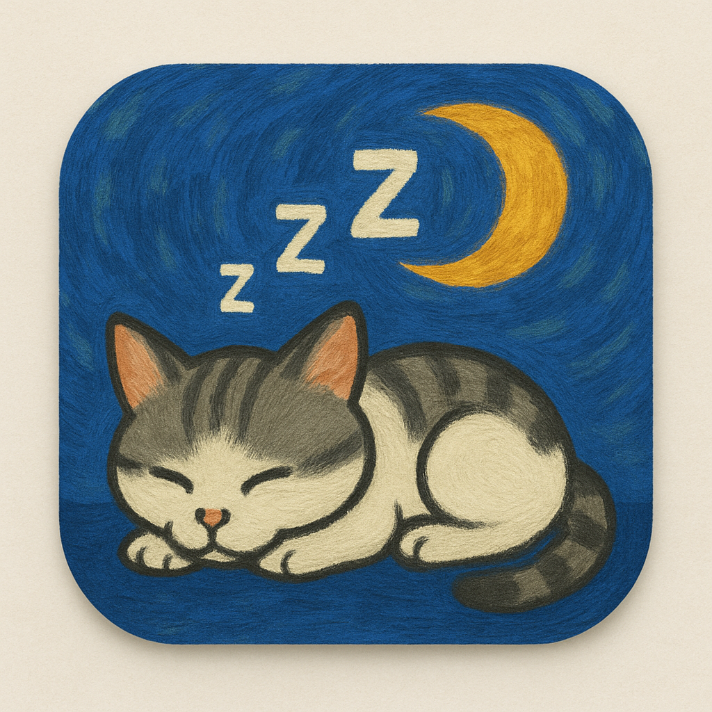

# 🐱 Sleeping Cat - Desktop Companion for macOS

A peaceful desktop companion that sleeps at the top of your screen. Watch as the cat's tail gently sways while it dreams.



## ✨ Features

- 🌙 Adorable sleeping cat animation
- 🎯 Stays at the top of your screen
- 🪶 Lightweight and unobtrusive
- 🎨 Hand-drawn artwork
- 💤 Realistic tail movement (62% static body, 38% animated tail)

## 📦 Installation

### Easy Install
1. Download the latest release from [Releases](https://github.com/yourusername/SleepingCat/releases)
2. Open the DMG file
3. Drag "Sleeping Cat" to your Applications folder
4. Launch from Applications

### Manual Build
```bash
git clone https://github.com/yourusername/SleepingCat.git
cd SleepingCat
swift build -c release
./create_app_bundle.sh
```

## 🎮 Usage

- **Launch**: Double-click "Sleeping Cat" in Applications
- **Move**: Click and drag the cat to reposition
- **Quit**: Right-click on the cat and select "Quit" (or Cmd+Q when focused)

## 🖥 System Requirements

- macOS 10.15 (Catalina) or later
- Apple Silicon or Intel Mac

## 🛠 Technical Details

- Built with Swift and AppKit
- Uses AVFoundation for smooth video playback
- Hybrid static/animated approach for optimal performance
- ProRes 4444 video format with alpha channel

## 📝 License

MIT License - See [LICENSE](LICENSE) file for details

## 🙏 Acknowledgments

- Original cat video by [your name/source]
- Icon artwork created with love

## 🐛 Troubleshooting

**Cat not appearing?**
- Check the top center of your screen
- Make sure no other windows are in full-screen mode
- Try relaunching the app

**Multiple cats appearing?**
- This has been fixed in v1.0
- Quit all instances and relaunch

---

Made with ❤️ for cat lovers everywhere